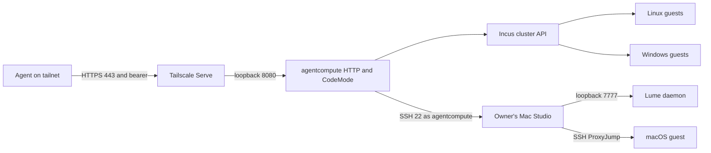

# Agentcompute architecture

Agentcompute exposes short-lived compute environments to agents through one
Streamable HTTP MCP endpoint, `https://agentcompute01.tailda715.ts.net/`.
The agent-facing surface is `search_api`, `describe_api`, and `execute`;
individual compute and desktop operations are Starlark capabilities, not MCP
tools. See [ADR-0009](../decisions/0009-use-codemode-as-the-agent-facing-mcp-surface.md).

This page describes the deployed boundaries. The
[implemented design](../designs/agentcompute.md) records the original intent
and deviations; the [runbook](../runbooks/agentcompute.md) owns deployment,
credential handling, and recovery.

## Request and execution boundaries

Tailscale Serve terminates publicly trusted, automatically renewed HTTPS and
forwards to `127.0.0.1:8080` in the `agentcompute01` VM. The Go HTTP handler
requires a named static bearer token and rejects cross-origin requests. It
shares one backend registry and reaper across HTTP sessions. A client reconnect
or service restart does not create a second inventory.

CodeMode evaluates bounded Starlark, not host Python or a host shell. Only
registered capabilities enter the backends. Guest `instance.exec` deliberately
executes commands inside the named sandbox guest; it does not expose Incus
credentials or a shell on `agentcompute01` to the caller. The `omp` bearer is
an administrator of this service surface, not a per-sandbox authorization
boundary. Subject metadata is attribution, not tenant isolation.

## Incus and OVN

The Incus backend owns projects prefixed `ac-`, with sandbox lifetime and
ownership in `user.agentcompute.*` metadata. Instances, networks, forwards,
snapshots, and sandbox-scoped published images belong to those projects.
Discovery reads backend state rather than a process-local inventory.

OVN is the default network kind. NAT networks allocate external addresses from
`10.10.40.64–10.10.40.127` through `fast40-uplink`. An isolated `nat=false`
network does not attach to the uplink or consume an external NAT address.
Inter-network routing requires an explicit guest router or `net.peer`.
Network forwards allocate their own external listen addresses; they are not
implicitly the network's NAT address. See
[ADR-0006](../decisions/0006-ovn-as-the-sandbox-network-fabric.md) and the
[address plan](../reference/networking/address-plan.md).

The service VM is in the Incus `default` project on `lab01`, outside disposable
sandbox projects. Its routed management NIC uses `10.10.10.16/32` through
`169.254.0.1`; its guest-side NIC is `10.158.86.2/24` on `ac-svc-vlan40`.
The route to VLAN 40 is through `10.158.86.1`. The tailnet address is
`100.65.152.20`. These paths do not bridge the IncusOS management bond or
require disabling `strict_hwaddr`.

The dedicated Incus client is **unrestricted cluster root**. Incus 7.4's
project-creation authorization prevented the intended restricted `ac-*`
identity: the OpenFGA model warns at project creation, and the authorization
scriptlet cannot inspect the new project's name. A pre-created project pool
with a restricted claim/release identity is deferred. The current mitigation
is the narrow authenticated service boundary, not a claim of least-privilege
Incus credentials.

## Mac backend

The owner's Mac Studio runs Lume as a separate standard, hidden `agentcompute`
account. It is not a dedicated machine. Tailnet policy permits the service tag
to reach Studio only on SSH port 22. Studio's authorized-key rules restrict the
service key to the verified `100.65.152.20` source. See
[ADR-0008](../decisions/0008-run-lume-in-a-confined-account-on-the-owners-mac-studio.md).

The backend reaches the host-local Lume HTTP daemon through SSH; port 7777 is
not published to the LAN or tailnet. Inventory and host work use the
account-local `/Users/agentcompute/bin/lume`, never the global install.
Guest execution uses SSH ProxyJump and SFTP with explicit host-key checking,
not a nonexistent `lume ssh` command. The qualified Tahoe seed supplies the
pinned guest host key and machine identifier. Retaining that machine identifier
preserves the qualified guest's activation and desktop permissions; the server
enforces a two-running-guest cap. The Mac backend does not pretend to provide
Incus OVN features.

A pinned source build temporarily supplies upstream Lume's merged
`--vnc disabled` feature, absent from release 0.5.3. Every backend start,
including restore and restart, uses `noDisplay: true` and `vnc: disabled`.
Startup refuses a CLI or daemon that cannot enforce the policy. This avoids a
wildcard VNC listener at its source; no high-port PF rule is installed on the
owner's LAN interfaces. `pins/lume.yaml` in agentcompute records the exact
source commit, installed binary digest, and the unchanged 0.5.3 release fallback.
Return to a release pin once a release includes the feature. The global Lume
install, Internet Sharing, and Continuity services remain outside service
ownership.

## Desktop transport and screenshots

The desktop API wraps Cua Driver over existing guest-execution channels rather
than exposing a second guest TCP service. Linux and macOS use the Driver's
one-shot CLI. Windows uses its persistent MCP transport through the guest
execution path. This is the trust and transport decision in
[ADR-0007](../decisions/0007-use-cua-driver-over-guest-execution.md).

Screenshot bytes are written under `/var/lib/agentcompute/screenshots` and
returned as opaque HTTPS URLs rooted at the service hostname. Screenshot URLs
are bearer capabilities: do not log or publish them for private workloads.
Their lifetime is tied to sandbox expiry/deletion; the HTTP service checks
that lifetime rather than treating a file on disk as perpetual authorization.
The service's systemd credential directory and Studio keys are not available
to guest desktop tools.

## Persistence and failure semantics

- Incus projects and Lume sandbox metadata survive an MCP process restart.
  The reaper reconciles expired sandboxes on its next pass, including those
  that expired while the process was stopped; it is not an in-memory timer.
- Incus snapshot restore stages a stopped copy before deleting the original,
  then renames the staged instance, reapplies current agentcompute metadata,
  and starts it. UUID, NIC identity, and DHCP address can change.
  Deleting the original also deletes its snapshot
  tree. This is recreate semantics, not an in-place filesystem rollback.
- A failed create or delete can leave backend resources needing reconciliation.
  The runbook distinguishes a slow asynchronous operation from a stuck
  sandbox and requires checking ownership before direct backend cleanup.
- Fleet OpenTofu owns the long-lived VM/network/DNS and public runtime
  configuration. Credentials are delivered out of band into root-only files
  and loaded by systemd. Application release installation converges the
  public configuration and binary without rerunning cloud-init or replacing
  the VM and its Tailscale identity.

## Ownership

`GilmanLab/agentcompute` owns the server, capability contracts, backend code,
image qualification, and release artifacts. `GilmanLab/fleet` owns service
infrastructure and runtime deployment. `GilmanLab/networking` owns tailnet and
network policy. `GilmanLab/secrets` owns encrypted credentials. This root
repository owns architecture, decisions, deployment guidance, and acceptance
evidence. Changes crossing those boundaries require companion PRs; runtime
experiments are not a substitute for updating the owning repository.
