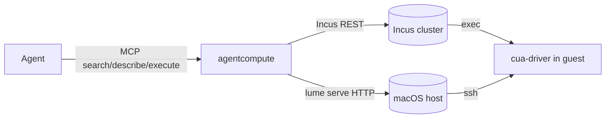

# agentcompute — disposable compute for agents

The proposal below is retained so implementation deviations remain visible.
Read [Implementation Outcome](#implementation-outcome) for those deviations,
the [architecture](../architecture/agentcompute.md) for runtime boundaries,
and the [runbook](../runbooks/agentcompute.md) for operations.

## Summary

`agentcompute` is a lab-specific MCP server, built on
[CodeMode](https://github.com/meigma/codemode) from
[`template-mcp-codemode`](https://github.com/meigma/template-mcp-codemode),
that lets coding agents create and drive throwaway containers and VMs on the
lab. An agent writes one short Starlark program against a small, stable
vocabulary (`sandbox.*`, `image.*`, `instance.*`, `net.*`, `desktop.*`) to
stand up an isolated environment, run commands in it, wire arbitrary network
topologies between instances, and see and operate a graphical desktop on
Linux, Windows, and macOS guests. Everything an agent creates lives inside a
named, time-limited sandbox that is destroyed as a unit.

This is not a general product. It targets exactly the lab stack: the
four-node IncusOS cluster for Linux and Windows guests, and an Apple Silicon
host for macOS guests.

## Context and Scope

Agents doing lab and product work repeatedly need a machine that is not the
workstation: to test an installer, reproduce a networking bug behind a NAT,
verify a GUI, or try something destructive. Today that means `sandbox01`
(one shared Ubuntu host) or hand-driven `incus` commands. Neither gives an
agent a self-serve, isolated, disposable environment, and neither gives it a
desktop.

The lab already has the substrate:

- The Incus cluster (`nas01`, `lab01`–`lab03`, cluster pool `data`)
  runs containers and KVM VMs, including Windows VMs from a repacked ISO.
  Runtime cluster configuration is owned by the `GilmanLab/fleet`
  `cluster/` pyinfra project; sandbox workloads are not cluster
  configuration and are created imperatively through the Incus API.
- Incus projects give per-sandbox namespacing and resource limits; managed
  bridge networks give per-sandbox L2 segments on one cluster member.
- VLAN 40 (`10.10.40.0/24`) is the routed sandbox/workload VLAN whose
  firewall posture already fits untrusted workloads (it cannot initiate to
  management or OOB). It is carried on the cluster's fast links, and
  the default-project physical network `fast40-uplink` exclusively owns
  the IncusOS-owned `fast40` parent. Sandbox NICs use managed logical networks. See the
  [address plan](../reference/networking/address-plan.md).
- macOS guests cannot run on Incus. They need Apple hardware running
  Apple's Virtualization framework, driven by
  [Lume](https://cua.ai/docs/reference/lume/cli-reference) (or Tart; see
  Alternatives).
- [Cua Driver](https://cua.ai/docs/reference/cua-driver/platform-support)
  is an in-guest desktop automation runtime for Windows, macOS, and Linux:
  accessibility-tree snapshots, semantic and pixel actions, screenshots,
  and browser control, exposed as MCP tools and as one-shot CLI calls with
  JSON output. It is the same model the operator's agent harness already
  uses for the host desktop.

CodeMode shapes the vocabulary directly, so its constraints are design
inputs, not implementation detail:

- Capabilities are dotted names called with keyword arguments only.
- Inputs are flat structs of scalars (`str`, `int`, `bool`, `float`, each
  optionally `None`). No lists or nested objects on input. Multi-valued
  operations are expressed as repeated calls inside the agent's program.
- Outputs may be rich (nested structs, lists, dicts) but are bounded (1 MiB
  per value by default). Binary payloads such as screenshots must not cross
  this boundary as values.
- One program is bounded by execution time and native-call count. Slow
  operations (VM boot, image fetch) need either raised limits or explicit
  wait capabilities.

In scope: the agent-facing vocabulary, the mapping of that vocabulary onto
Incus and Lume, how agents reach guests, and the lab prerequisites.

Out of scope for this draft: the exact Go package layout, the authorization
policy, and the deployment form of the server. Those follow the prototype.

## Goals

- An agent can create an isolated environment, launch Linux/Windows/macOS
  instances into it, run commands, and destroy it, in one or two `execute`
  calls and with no operator involvement.
- An agent has root-equivalent, unrestricted control inside its sandbox.
- An agent can build multi-segment topologies (NAT, routed, isolated,
  impaired links) between instances in a sandbox.
- An agent can take screenshots of and send keyboard and pointer input to a
  guest desktop.
- Sandboxes expire. Nothing an agent forgets outlives its TTL.
- The vocabulary is small enough to be discoverable through `search_api` and
  stable enough that agents' saved programs keep working.

## Non-goals

- Durable workloads. Anything meant to survive the day belongs in OpenTofu
  or CAPI, not here.
- Generality. No second-user abstraction over hypervisors; the two backends
  (Incus, Lume) are named and their differences are exposed, not hidden.
- Cluster configuration. Storage pools, cluster-wide networks, and profiles
  stay with `fleet`.
- Multi-tenant isolation between agents beyond project separation. The lab
  has one operator.

## Design Overview



`agentcompute` is one Go binary from `template-mcp-codemode`. Each
capability handler is a thin translation onto either the Incus client
library or Lume's HTTP API. The server keeps almost no state of its own:
the sandbox registry is the set of Incus projects (and Lume VM name
prefixes) carrying `user.agentcompute.*` metadata, so a restarted server
sees the same world.

Sandbox networking is **OVN**. IncusOS ships the OVN chassis (`ovn-controller`
and OVS, configured through the
[OVN service](https://linuxcontainers.org/incus-os/docs/main/reference/services/ovn/))
but no OVN central. The lab's durable `ovncentral01` VM is pinned to `nas01`'s
unmanaged management bridge and runs `ovn-northd` with standalone NB/SB
databases. Both databases require mutual TLS from the application-scoped
offline OVN CA. See the
[OVN central and certificate runbook](../runbooks/ovn-central-and-certificates.md).
Each sandbox network is an Incus OVN network: a Geneve overlay that spans the
cluster, with a logical router, DHCP, DNS, network ACLs, and peering built in.
A NAT-enabled network also has SNAT and can host network forwards. An isolated
`nat=false` network uses Incus `network=none`, has no external allocation, and
has no direct lab or internet path. It becomes reachable from another network
only through `net.peer` or a router instance attached to both networks.
Instances in one sandbox can land on different members, and ordinary
NAT-enabled and peered topologies need no router instance.

The `default_network_kind=bridge` fallback keeps an entire sandbox on
member-local bridges, including bare L2 wires. Incus does not support mixing
those default-project bridges with project-owned OVN networks while retaining
managed-only NICs. A mixed-kind request returns `AgentError`; the server never
changes an explicit kind or relaxes the NIC restriction.

Every sandbox starts with a **default network**: an OVN network with NAT
to the sandbox VLAN. Instances land on it unless the agent says otherwise.
That is how guests reach the internet and, through forwards, how agents
reach services they start. Experimental topologies are built on additional
networks. A guest that must have no side channel is attached only to an
isolated `nat=false` network; `instance.exec` and everything built on it still
work through the Incus agent.

Desktop work rides **Cua Driver inside the guest, invoked over exec**.
Curated `/desktop` images ship a desktop environment with the Driver
daemon running in the logged-in graphical session. `agentcompute` runs
`cua-driver call <tool> <json> --screenshot-out-file <path>` through the Incus agent (or `lume ssh`),
returns the structured result, and pulls any screenshot file through the
instance file API to serve it over HTTP. No guest network reachability is
required, so desktops work behind an agent's NAT topology. The hypervisor
console is not used: Incus exposes VGA only as SPICE, which has no usable
Go client. In-guest VNC remains available as the fallback for pre-login
screens, installers, and human viewers.

## Detailed Design

### Vocabulary

The vocabulary is the contract. Everything else in this document exists to
make these names true. Conventions:

- Five roots. `sandbox` is the lifecycle unit; the rest take `sandbox` as
  their first argument.
- Verbs are the boring ones: `create`, `delete`, `list`, `get`, `start`,
  `stop`, `restart`, `exec`, `wait`, `attach`, `detach`.
- Names identify things. Sandboxes, instances, networks, NICs, and
  snapshots are addressed by the name the agent gave them, never by an
  opaque ID. Names match `[a-z0-9]([a-z0-9-]{0,30}[a-z0-9])?`; `default`
  and `none` are reserved. An omitted sandbox name is generated.
- Blocking by default. `instance.create` returns when the instance is
  running; there is no operation-ID plumbing for the agent to poll.
  Explicit `wait` capabilities cover the readiness stages that are slower
  than "running".
- Errors are Starlark errors with a short, actionable message, via
  `codemode.AgentError` ([meigma/codemode#59](https://github.com/meigma/codemode/pull/59)):
  unknown or expired resources, unsupported kinds, and not-ready
  instances say so by name. A capability an image or backend does not
  support (for example `net.*` on the Mac) fails with a message that says
  so; it is not silently no-op'd. Backend faults stay a bare
  `capability failed` and are logged server-side.

Optional arguments are marked `?`. Output shapes are indicative; the exact
shape is whatever `describe_api` reports from the Go types.

#### `sandbox` — the lifecycle, isolation, and placement unit

| Capability | Arguments | Returns | Notes |
| --- | --- | --- | --- |
| `sandbox.create` | `name?`, `platform?` (`incus` default, `mac`), `ttl_minutes?` | `{name, platform, expires_at, network}` | Creates an Incus project (or Lume name prefix) named after the sandbox, plus its `default` NAT'd network. Default TTL 240 minutes. |
| `sandbox.list` | — | `list[{name, platform, created_at, expires_at, instances: int}]` | |
| `sandbox.get` | `name` | `{name, platform, created_at, expires_at, instances: list[...], networks: list[...]}` | One call for an agent to re-orient. |
| `sandbox.extend` | `name`, `ttl_minutes` | `{expires_at}` | Extends from now. |
| `sandbox.delete` | `name` | `{}` | Records expiry, then destroys owned resources in dependency order. A partial failure remains discoverable for reaper retry; an unknown sandbox returns `AgentError`. |

Expired sandboxes are deleted by a reaper inside `agentcompute`.

#### `image` — the curated catalog

| Capability | Arguments | Returns | Notes |
| --- | --- | --- | --- |
| `image.list` | `os?`, `desktop?`, `platform?` | `list[{name, os, version, kind, desktop, platform, description}]` | Catalog is a static list in the server config, mapping names to Incus aliases or Lume OCI references. |

Indicative catalog:

| Name | Kind | Backend | Notes |
| --- | --- | --- | --- |
| `ubuntu/24.04` | container or vm | Incus `images:` remote | Default Linux. |
| `ubuntu/24.04/desktop` | vm | lab-built | GNOME on Xorg, Cua Driver daemon in the user session, VNC fallback. X11 because the Driver's Linux support is strongest there. |
| `debian/13`, `fedora/43`, `alpine/3.22` | container or vm | Incus `images:` remote | |
| `router` | container | lab-built | Alpine or Debian with `nftables`, `frr`, `iproute2`/`tc`, `dnsmasq`, `wireguard`, `tcpdump`. The building block for NAT, routing, and impairment topologies. |
| `windows/11/desktop` | vm | lab-built, cluster-local | Repacked with `distrobuilder repack-windows`, virtio drivers, autounattend, Cua Driver daemon at logon, VNC fallback. Captured on the cluster; never published to a registry. |
| `windows/server-2025` | vm | lab-built, cluster-local | Headless. Same capture and non-publication rule. |
| `macos/sequoia/desktop` | vm | lab-built, Mac-local | `lume create --unattended` from a pinned IPSW; Cua Driver with Accessibility and Screen Recording granted once by an operator; Screen Sharing as the VNC fallback. Kept as a stopped seed on the Mac; never published to a registry. |

Agents can add to a sandbox's local catalog with `instance.publish` (below).
Lab-built images are produced by a pinned recipe in the implementing
repository, consistent with the image-distribution principle, but they are
not part of this draft. Linux images are published to GHCR as imgoci
releases and imported by digest; Windows and macOS images stay lab-local
(an Incus alias on the cluster, a stopped Lume seed on the Mac) because
their licenses do not grant registry redistribution. The catalog entry
records a digest for the former and an alias or seed name for the latter.

#### `instance` — containers and VMs

| Capability | Arguments | Returns | Notes |
| --- | --- | --- | --- |
| `instance.create` | `sandbox`, `name`, `image`, `kind?` (`container`/`vm`; default from image), `cpus?`, `memory_mb?`, `disk_gb?`, `network?` (default `default`; `none` for no NIC), `host?`, `start?` (default `true`) | `{name, kind, host, status, addresses: dict[str, list[str]]}` | Blocks until the instance is running. Desktop images also wait for the Driver daemon. `host` pins a cluster member; default is least-loaded. |
| `instance.list` | `sandbox` | `list[{name, kind, image, status, addresses}]` | |
| `instance.get` | `sandbox`, `name` | `{name, kind, image, status, cpus, memory_mb, nics: list[{name, network, mac, addresses}], desktop: bool, snapshots: list[str]}` | |
| `instance.start` / `instance.stop` / `instance.restart` | `sandbox`, `name`, `force?` | `{status}` | Blocking. |
| `instance.delete` | `sandbox`, `name` | `{}` | Stops first if needed. |
| `instance.wait` | `sandbox`, `name`, `until` (`running`, `agent`, `network`, `desktop`, `stopped`), `timeout_seconds?` | `{status, elapsed_seconds}` | The one place slow readiness is spent. |
| `instance.exec` | `sandbox`, `name`, `command`, `timeout_seconds?`, `user?`, `cwd?`, `stdin?`, `env?` | `{exit_code, stdout, stderr, timed_out}` | `command` is a shell string run by the guest's native shell (`sh -c`, `cmd.exe /c`, `zsh -c`). `env` is a `KEY=VALUE\n` string because inputs are flat. Output is truncated to a stated byte cap. |
| `instance.file.write` | `sandbox`, `name`, `path`, `content`, `mode?` | `{bytes}` | Text-sized files. Large transfers use `instance.exec` with `curl`. |
| `instance.file.read` | `sandbox`, `name`, `path`, `max_bytes?` | `{content, truncated}` | |
| `instance.snapshot.create` | `sandbox`, `name`, `snapshot` | `{}` | Creates a stateless named snapshot. |
| `instance.snapshot.restore` | `sandbox`, `name`, `snapshot` | `{}` | Recreates the instance from the snapshot, retains the agent-facing instance name and metadata, starts it, and waits for `Running`. The UUID changes and the NIC MAC can change; successful restore consumes every snapshot on the original instance. |
| `instance.snapshot.delete` | `sandbox`, `name`, `snapshot` | `{}` | Deletes one named snapshot without restoring it. |
| `instance.snapshot.list` | `sandbox`, `name` | `list[{name, created_at}]` | Lists snapshots still attached to the current instance. |
| `instance.publish` | `sandbox`, `name`, `image` | `{image}` | Produces a sandbox-scoped image the agent can `instance.create` from. Dies with the sandbox. |

#### `net` — sandbox networks and links

| Capability | Arguments | Returns | Notes |
| --- | --- | --- | --- |
| `net.create` | `sandbox`, `name`, `kind?` (`ovn` default, `bridge`), `cidr?`, `dhcp?`, `nat?`, `dns?` | `{name, kind, cidr, gateway}` | `ovn`: a cluster-wide segment with a logical router at `.1`; `nat` masquerades to the sandbox VLAN; `dhcp` and `dns` are on by default. nat=false networks are unreachable from outside the sandbox; attach a router instance or use net.peer. `bridge`: a bare L2 wire on one member, no router, nothing served; the agent brings its own. |
| `net.list` / `net.get` / `net.delete` | `sandbox` [, `name`] | | Delete fails while NICs are attached. |
| `net.attach` | `sandbox`, `instance`, `network`, `nic?`, `ip?`, `mac?` | `{nic, mac}` | Hot-plugs a NIC. `nic` names the device (`eth1`…); `ip` requests a static lease. |
| `net.detach` | `sandbox`, `instance`, `nic` | `{}` | |
| `net.peer` | `sandbox`, `network`, `peer` | `{}` | Routes between two OVN networks in the sandbox without a router instance. |
| `net.acl.add` | `sandbox`, `network`, `direction` (`ingress`/`egress`), `action` (`allow`/`drop`/`reject`), `protocol?`, `src?`, `dst?`, `port?` | `{rule}` | Stateful rule on the network's logical router. `agentcompute` installs immutable management/OOB denies. An `allow` requires an explicit IP/CIDR `dst` outside both protected ranges, for ingress and egress. |
| `net.acl.remove` | `sandbox`, `network`, `rule` | `{}` | |
| `net.forward` | `sandbox`, `network`, `instance`, `port`, `listen_port?`, `protocol?` | `{address, port}` | Exposes an instance port on an address from the uplink's OVN range. Available only on NAT-enabled networks; an isolated-network request returns `AgentError`. |
| `net.impair` | `sandbox`, `instance`, `nic`, `latency_ms?`, `jitter_ms?`, `loss_percent?`, `rate_mbit?`, `clear?` | `{}` | Applies `tc netem` inside a Linux guest on that NIC. Intended for `router` instances so guests under test stay untouched. Fails on non-Linux guests. |

OVN covers the floor. Routing protocols, exotic NAT (hairpin, port-restricted),
link impairment, VPN endpoints, and anything else OVN cannot express are
not capabilities: they are `instance.exec` against a `router` instance
attached to two or more networks. The `router` image is the extension
point: as recurring agent patterns show up, they become helper scripts
baked into the image before they become new vocabulary.

#### `desktop` — Cua Driver, proxied

All `desktop.*` capabilities require a desktop-capable instance: one whose
image is `/desktop`, or one the agent has prepared by installing Cua
Driver into the graphical session and calling `desktop.enable`.

| Capability | Arguments | Returns | Notes |
| --- | --- | --- | --- |
| `desktop.info` | `sandbox`, `instance` | `{ready, os, driver_version, tools: list[str], vnc?: str}` | `tools` is the Driver tool catalog for that guest's OS. `vnc` is the fallback viewer endpoint when one exists. |
| `desktop.enable` | `sandbox`, `instance` | `{ready}` | Verifies the Driver daemon answers inside the guest. |
| `desktop.call` | `sandbox`, `instance`, `tool`, `args?` | `{ok, summary, result, screenshot_url?}` | Runs `cua-driver call <tool> <json> --screenshot-out-file <path>` in the guest. `args` is a JSON object as a string because inputs are flat; `result` is the structured content as a JSON string for `json.decode`. Any screenshot is written in-guest, pulled, and served over HTTP. |
| `desktop.screenshot` | `sandbox`, `instance`, `pid?`, `window_id?`, `max_dimension?` | `{url, width, height, scale}` | Convenience over `get_desktop_state` / `get_window_state(include_accessibility_tree=false)`. |

The Driver's own vocabulary is the desktop vocabulary: `list_apps`,
`launch_app`, `list_windows`, `get_window_state` (AX tree with element
tokens plus a screenshot), `click`, `type_text`, `press_key`, browser
tools, and the rest. `agentcompute` does not re-model those 50-odd tools
as flat-scalar capabilities; `desktop.call` is the pass-through, and
typed conveniences are added only where agents demonstrably fumble the
JSON string. The agent follows the Driver's action policy: prefer an
element token from a fresh `get_window_state`, fall back to pixels, and
escalate to foreground delivery last. Snapshot tokens are per
`(pid, window_id)` and expire on the next snapshot; `agentcompute` holds
no desktop state.

### A representative program

```python
def main():
    sb = sandbox.create(name="nat-repro", ttl_minutes=120)
    lan = net.create(sandbox="nat-repro", name="lan", cidr="192.168.50.0/24", nat=False)
    # The isolated LAN reaches outside only through the router's WAN NIC.
    wan = net.create(sandbox="nat-repro", name="wan", cidr="10.99.0.0/24", nat=True)

    # Port-restricted NAT is beyond OVN's SNAT, so a router instance does it.
    instance.create(sandbox="nat-repro", name="rtr", image="router", network="lan")
    net.attach(sandbox="nat-repro", instance="rtr", network="wan")
    instance.exec(sandbox="nat-repro", name="rtr", command="/opt/router/nat --mode port-restricted --inside eth0 --outside eth1")

    instance.create(sandbox="nat-repro", name="client", image="ubuntu/24.04/desktop", network="lan")
    instance.wait(sandbox="nat-repro", name="client", until="desktop", timeout_seconds=300)

    shot = desktop.screenshot(sandbox="nat-repro", instance="client")
    apps = json.decode(desktop.call(sandbox="nat-repro", instance="client", tool="list_apps")["result"])
    return {"router": instance.get(sandbox="nat-repro", name="rtr")["nics"], "screenshot": shot["url"], "apps": apps}
```

`client` sits only on `lan` behind `rtr`, which makes the NAT test honest.
Its desktop is still reachable because `desktop.*` rides `instance.exec`,
not the network.

### Backend mapping

| Concept | Incus | Lume (macOS host) |
| --- | --- | --- |
| Sandbox | Project `ac-<name>` with `features.networks=true`, `features.images=true`, `user.agentcompute.expires_at`, `restricted` limits; instances placed per call with `--target` | Name prefix `ac-<name>-`; a JSON sidecar for metadata |
| Instance | Container or VM in the project | `lume clone` + `lume run --detach --display none` via `lume serve` |
| Default network | OVN network with `ipv4.nat=true` on the sandbox VLAN uplink | Lume is NAT-only ([trycua/cua#1007](https://github.com/trycua/cua/issues/1007)); guests reach out but are reachable only from the Mac |
| Additional networks | OVN networks in the project (cluster-wide); or managed `bridge` networks, which Incus instantiates on every member as separate L2 domains and which live in the `default` project under short generated names mapped by metadata (a bridge-backed sandbox keeps its instances on one member); peers, ACLs, and forwards are the Incus objects of the same names | Unsupported (`net.*` errors) |
| Exec | `/1.0/instances/<n>/exec` via the Incus agent | `lume ssh <vm> <command>` |
| Desktop | `cua-driver` CLI over exec; screenshot files pulled with the file API | `cua-driver` CLI over `lume ssh`; files pulled with `scp` |
| Snapshot | Instance snapshots | `lume clone` of a stopped VM |

### Where the server runs

The durable `agentcompute` deployment target is a **Streamable HTTP service**
in a VM on the cluster (OpenTofu-owned, per the one-off-VM decision), with a
client certificate for Incus and an SSH key for the Mac host. That is the form
that makes it usable from any agent host, keeps the reaper alive
independently of any agent session, and is the only form under which
the TTL guarantee holds.

The stdio transport is a development convenience: run on the operator
workstation, reaching the Incus API on VLAN 10 and guests on VLAN 40
through the existing Tailscale subnet routes. A stdio process exits with
its client, so sandboxes it created are reaped only when some
agentcompute is next running. Do not rely on stdio for anything with a
TTL that matters.

### Lab prerequisites

These changes live in other repositories. The first three infrastructure
prerequisites were completed in Phase 5. The application lifecycle and outage
behavior were qualified separately and are recorded under Validation.

1. **OVN central — complete.** The OpenTofu-owned `ovncentral01` VM is pinned
   to `nas01` on its unmanaged VLAN 10 management bridge. It runs the pinned
   `ovn-central` package with standalone NB/SB databases and per-component TLS
   gates. Remote database access is mutual TLS only. The dedicated offline OVN
   CA is EC P-256 and valid for ten years; central and each chassis have
   separate two-year leaves. Fleet owns issuance, delivery, and renewal under
   ADR-0003. The CA is not part of ADR-0005's KMS hierarchy; revisit Vault
   issuance when Vault PKI exists and there is a reason to migrate. The
   transitional central on `sandbox01` has been purged. See the
   [operations runbook](../runbooks/ovn-central-and-certificates.md).
2. **OVN chassis on every node — complete.** Fleet converges
   `/os/1.0/services/ovn` on all four members, with each member's VLAN 30
   storage address as its Geneve tunnel address and its own TLS leaf. The
   Incus global OVN client uses the `nas01` leaf.
3. **An OVN uplink on the sandbox VLAN — complete.** Fleet owns the
   cluster-wide `physical` uplink on the IncusOS-owned `fast40` parent and the
   approved external range. The
   [address plan](../reference/networking/address-plan.md#ovn-external-addresses)
   is the only source for that allocation and its capacity calculation.
4. **An Incus identity for `agentcompute`** with rights to create
   projects. Fleet `cluster/` concern.
5. **A macOS host.** A dedicated Apple Silicon machine in the lab (a
   Mac mini is enough) running `lume serve`, reachable from the server,
   with SSH. Not a personal workstation: the consented Driver seed is a
   security-relevant artifact and the backend must not vanish when a lid
   closes. Apple limits a host to two concurrent macOS guests.
6. **Lab-built images**: the `router` container, one Linux desktop VM, one
   Windows desktop VM. Built from pinned recipes in the `agentcompute`
   repository until they earn a product home.
7. **CodeMode ≥ v0.2.1** for `AgentError`
   ([meigma/codemode#59](https://github.com/meigma/codemode/pull/59),
   [v0.2.1](https://github.com/meigma/codemode/releases/tag/v0.2.1)).
   Without it every failure is a bare `capability failed`.

## Cross-cutting Concerns

### Security and Privacy

Sandboxes are untrusted by construction: agents run arbitrary code as root
and can be prompt-injected by what they test. The sandbox VLAN's existing
firewall posture (no initiation toward management or OOB) is the boundary,
and it must hold for the new attachment path. Incus `restricted` project
settings prevent privileged containers, host device passthrough, and
nesting escapes. The Mac host is a softer boundary; it should hold nothing
but Lume.

An isolated `nat=false` network has no direct path to the lab or internet.
This absence of an external path complements, rather than replaces, the
baseline ACLs. Peering or attaching a dual-NIC router intentionally adds a
path and remains subject to those ACLs.

The server installs baseline egress ACL drops for the protected management and
OOB ranges. Agents cannot remove those rules. As a conservative current
contract, `net.acl.add` rejects every `allow` unless `dst` is a literal IP
address or CIDR that excludes both protected ranges. The same restriction
applies to ingress because Incus evaluates native ingress rules from the
opposite endpoint perspective. This restriction remains in place while native
ACL interaction is qualified; the design does not rely on an unproven priority
relationship. Sandbox projects retain `restricted.devices.nic=managed`.
`restricted.containers.lowlevel=block` is non-negotiable. Snapshot restore
recreates the instance rather than weakening this project restriction to make
Incus's native in-place restore succeed.
Before uplink reconciliation, fleet checks default-project networks (including
member-specific configuration), profile NICs, and instance NICs across all
members. Any competing parent attachment or direct physical-uplink NIC aborts
the deploy with the resource named; fleet never deletes a conflict.

`agentcompute` itself is single-operator. Authorization starts as
`AllowAll`; the subject is recorded on each sandbox so a later policy can
scope agents to their own sandboxes.

### Reliability and Failure Modes

The server is stateless with respect to sandboxes, so a crash loses at
most in-flight screenshot files. In the durable deployment, the reaper runs
on process start and on a timer inside the long-running HTTP service. That
deployment, not an agent session, keeps the TTL promise. A sandbox pinned to a
member that goes offline is broken until the member returns; sandboxes are
not migrated. Deletion proceeds in dependency order: forwards and peers, NIC
references, instances and snapshots, sandbox images, profile references,
networks and owned ACLs, then the project. A partial failure leaves the
sandbox discoverable and is retried on every reaper scan until nothing owned
remains.

Snapshot restore is a destructive replacement operation. Incus cannot natively
restore this running-instance snapshot under
`restricted.containers.lowlevel=block` because the saved
`volatile.eth0.host_name` is low-level configuration. The approved path stages
a stopped copy from the snapshot **before** deleting the parent, because parent
deletion also deletes the source snapshot. It then deletes the original and all
of its snapshots, renames the staged copy to the original agent-facing name,
reapplies the current `user.agentcompute.*` metadata, starts the replacement,
and waits for `Running` under the same sandbox service gate. See
[Incus issue #3993](https://github.com/lxc/incus/issues/3993).

A successful restore consumes every snapshot that belonged to the original,
not only the selected snapshot. The replacement has a new instance UUID and
new volatile NIC state, so its MAC address, DHCP identity, lease, and assigned
address can change. Callers must rediscover the instance and its addresses
after restore.

A stop failure preserves the original and its snapshots; inspect its power
state. A copy failure after a successful stop leaves the original stopped with
its snapshots intact; inspect for a generated `restore-*` copy before retrying.
Deletion removes the original's snapshots before deleting the original itself.
If that final deletion fails, the original and staged copy can both remain,
but the snapshots are already consumed; the error identifies the staged copy.
After original deletion, a rename failure leaves
the replacement under its generated name. A start or `Running`-wait failure
returns an error with the replacement under the original agent-facing name;
inspect its status before retrying.

One live restricted-project probe on 2026-09-13 reached `Running` with the
agent-facing name preserved. Its instance UUID changed, and its source MAC
changed from `10:66:6a:71:f1:63` to `10:66:6a:f0:88:bc`. This confirms the
recreation and identity-change behavior; it is not full Phase 5 lifecycle
acceptance.

OVN central must be available for every OVN create, update, and delete.
An owned `Errored` NAT-enabled network holds its external address until
deletion. During a central outage, an expired project stays pending; a later
reaper scan resumes dependency-ordered cleanup after central recovers.
The retry does not restart OVS, a chassis, the uplink, or central. Existing
installed flows may survive a central outage; that dataplane behavior does not
make control-plane mutations safe.

A provider-parent conflict is separate from central unavailability. Fleet
preflight names a competing network, profile, or instance NIC and refuses
convergence without deleting it. The sandbox deletion retry does not own or
repair infrastructure parent conflicts. Phase 3 demonstrated this distinction:
after fleet deleted the raw macvlan fixture `default/soak01`, the first
lab01-gateway cycle passed in 31.018 seconds without reboot or
service/neighbor repair. See the
[qualification report](https://github.com/GilmanLab/agentcompute/blob/spike/ovn-recreate-diagnosis/spikes/ovn/README.md).

### Performance and Capacity

CodeMode's default 5 s execution budget and 100 native calls per program
are wrong for this workload. VM creation and desktop readiness are
minutes. The server raises `MaxExecutionTime` to the order of 15 minutes
and native calls to 1,000; `instance.wait` is where the time goes.
Screenshot images never cross the value boundary. Capacity is bounded by
project limits (indicative: 8 vCPU, 16 GiB, 100 GiB per sandbox) and by
the TTL reaper. Geneve tunnels ride the VLAN 30 storage links; sandbox
east-west traffic is small.

Phase 3 measured a 1442-byte OVN guest MTU over the 1500-byte underlay.
The operator's Tailscale path used a 1280-byte tunnel MTU. Desktop and file
transfers must not assume a 1500-byte end-to-end path; see the
[Phase 3 measurements](https://github.com/GilmanLab/agentcompute/blob/master/spikes/ovn/README.md).

The approved OVN range contains 64 external addresses. Only NAT-enabled
networks and distinct forward listen addresses consume them. The
representative `default` NAT, isolated `lan`, `wan` NAT, and one-forward
topology consumes three addresses per sandbox: eight sandboxes consume 24 and
leave 40 for additional allocations and pending cleanup. The
[address plan](../reference/networking/address-plan.md#ovn-external-addresses)
is authoritative.

## Delivery

Agile: each step is a working slice that an agent uses before the next is
designed in detail.

1. Vocabulary review (this document). Agree the nouns and verbs; rename
   before code exists.
2. Prototype on the cluster with Linux containers only: `sandbox.*`,
   `image.list`, `instance.create/exec/delete`, `net.create/attach` with
   `kind="bridge"` and a temporary NAT'd bridge as the default network, so
   neither the VLAN nor OVN blocks learning. Throwaway is acceptable.
3. OVN infrastructure: Phase 3 qualified the mechanism with the temporary
   `sandbox01` central, four chassis using VLAN 30 tunnel addresses, a temporary
   uplink, cross-node ping, and a forward. Phase 5 replaced that infrastructure
   with the durable OpenTofu central, mutual TLS, the fleet-owned uplink, and
   the approved external range, then purged the transitional central. The live
   MCP lifecycle and central-outage acceptance evidence is recorded below;
   infrastructure delivery alone did not establish that result.
4. Linux desktop image with Cua Driver, and `desktop.*` over exec. This is
   the step most likely to change the vocabulary.
5. Windows desktop image. `net.impair` and the `router` image.
6. macOS via Lume.
7. Promote the draft; deploy the server as a cluster VM; write the
   runbook; record the durable choices as decision records (OVN as the
   sandbox fabric is one).

### Validation

- An agent, given only `search_api`, completes the representative program
  above without operator help.
- A sandbox with `ttl_minutes=1` and one running VM is gone within two
  minutes of expiry with no residue in `incus project list`.
- A `client` on `lan` behind `rtr` reaches the internet and shows a
  routed source of `rtr`'s `wan` address from the `wan` side.
- Two instances on one OVN network placed on different members ping each
  other; a `net.forward` on the default network is reachable from the
  operator workstation.
- An isolated `nat=false` network receives no external allocation and has no
  direct lab or internet path. `net.peer` and a dual-NIC router each provide
  intentional reachability; `net.forward` on the isolated network returns
  `AgentError`.
- The representative NAT-enabled `default`, isolated `lan`, NAT-enabled
  `wan`, and one-forward topology consumes three external addresses per
  sandbox: 24 for eight sandboxes, leaving 40 of the 64-address reservation.
- Snapshot create, list, and delete retain their named-resource behavior.
  Restore returns only after a replacement with the same agent-facing name is
  `Running`; the UUID changes, callers tolerate MAC/DHCP identity change, all
  original snapshots are consumed, and each injected failure preserves the
  staged or replacement instance described above.
- `desktop.screenshot` on a Windows guest returns an image in under 2 s
  after the desktop is ready.

### Phase 5 acceptance evidence

The application lifecycle run completed in 308.22 seconds. It exercised the
dual-NIC router NAT path, forwards, native `nat=false` isolation,
sandbox-local publication and clone, the approved snapshot-recreation
contract, and dependency-ordered deletion.

The central-outage qualification stopped central before rebooting only
`lab03` through fleet's receipt-backed reboot command. The member management
API was unavailable for approximately 112 seconds, then returned `Online` and
`Fully operational` while central remained stopped. A surviving
`lab01`-to-`nas01` guest path completed three of three pings throughout. A
guest on the rebooted member completed zero of three during the outage; after
central was started once, with no other repair or restart, both paths
completed three of three.

A separate create during the outage left an owned expired project and an
`Errored` NAT-enabled `default` network holding `10.10.40.65`. The reaper
returned backend unavailable in 480 ms and retained both for retry. After the
single central start, a later scan removed all owned fixture residue across
all four members and all projects in 3.03 seconds. The subsequent 11-operation
fleet dry run was a no-op.

## Alternatives Considered

### One MCP tool per operation (no CodeMode)

- Familiar; no Starlark.
- Every topology needs a dozen round trips, each dragging intermediate
  output into context.
- Not chosen: composition in-program is exactly what multi-instance,
  multi-network setups need, and codemode is the house style.

### Raw VNC as the primary desktop path

- Backend-agnostic; works at the login screen and inside installers.
- Pixels only: no accessibility tree, no semantic actions, no browser
  control; needs a reachable guest network; agents must reinvent
  window discovery from screenshots.
- Not chosen as primary. Kept as the fallback for pre-login screens and
  human viewers.

### Hypervisor console (SPICE) for desktops

- Works before any guest agent exists; works for any OS on Incus.
- No usable Go SPICE client; would need a headless native client as a
  sidecar. Not applicable to Lume.
- Not chosen for now.

### Tart instead of Lume for macOS

- Bridged and softnet networking, a Packer plugin for image recipes, and
  a longer CI track record.
- Fair Source license; CLI only, no API server; no first-party pairing
  with an in-guest agent.
- Not chosen provisionally. Lume's HTTP API, MIT license, and Cua Driver
  images fit better now that guest networking is not needed for desktop
  work. Swap if Lume's NAT-only networking or stability disappoints in
  step 6; the adapter is thin.

### Cua Sandbox SDK or Cua Fleets as the sandbox layer

- The Sandbox SDK already models images, exec, and screenshots; Fleets
  are managed cloud desktops with zero lab work.
- Python SDK with local runtimes of QEMU, Docker, Hyper-V, Lume, and the
  Android emulator; no Incus runtime, no multi-segment networking,
  snapshots not implemented. Fleets are off-lab, paid, Linux and Windows
  only.
- Not chosen. It would replace the substrate rather than complement it,
  and the lab is the point. Fleets remain the buy option if the lab path
  stalls.

### Per-member bridge networks only (no OVN)

- Nothing new to run; managed bridges already work on the cluster.
- Sandboxes pinned to one member; NAT, DHCP, and firewalling every time
  through a router instance; agents reach services only via a management
  NIC on the raw VLAN.
- Not chosen as the target; it is the step-2 prototype and the fallback if
  the OVN spike is not smooth. Bridges stay available as `kind="bridge"`.

### Kubernetes-hosted sandboxes (KubeVirt, vcluster)

- Would land on the eventual platform cluster.
- The platform cluster does not exist yet; desktops and Windows on KubeVirt
  are a much longer road; macOS impossible.
- Not chosen.

### Doing nothing (keep using `sandbox01` by hand)

- Zero work.
- No isolation, no desktops, no topologies, no cleanup.
- Not chosen.

## Design Questions

### Resolved in review

These decisions describe the reviewed proposal; later amendments are recorded
in Implementation Outcome rather than silently rewriting the proposal.

- **The word `sandbox`** stays. Agents already think in it; the collision
  is with a host and a repository, neither of which an agent sees.
- **Screenshot return path** is the HTTP URL only. No base64 fallback:
  the deployed service is reachable from agent hosts the same way
  everything else in the lab is, and the agent harness reads image URLs.
- **macOS host** is a dedicated Apple Silicon box in the lab (prerequisite
  5).
- **Deployment form** is Streamable HTTP in a cluster VM; stdio is
  development-only ("Where the server runs").
- **Blocking operations** stay. Raise `MaxConcurrentExecutions` before
  considering an asynchronous pattern.
- **OVN central** is the OpenTofu-owned `ovncentral01` VM on `nas01`; no Raft.
  The [operations runbook](../runbooks/ovn-central-and-certificates.md)
  defines its deployment, renewal, and recovery. Whether it later serves Talos
  networks is a T10/T11 question, not this design's.
- **Windows and macOS images are not published** to any registry; they
  are cluster-local and Mac-local respectively ("image" catalog).
- **`desktop.call` ergonomics**: pass-through first; typed conveniences
  only for tools agents demonstrably fumble.
- **VLAN 40** is the durable OVN uplink VLAN (owner decision, 2026-09-12).
  The [address plan](../reference/networking/address-plan.md#ovn-external-addresses)
  records the approved 64-address allocation and eight-sandbox planning
  target. Default-plus-forward consumes two external addresses per sandbox;
  adding an isolated `lan` and NAT-enabled `wan` brings that budget to three.
  Count `Errored` NAT-enabled
  networks until deletion. A dedicated VLAN is reconsidered only if OVN
  needs more than this allocation; DHCP, named endpoints, and routes stay
  unchanged.

### Resolved during implementation

1. **Driver token continuity:** Linux and macOS retain the one-shot CLI
   transport over guest exec. Windows needs a persistent Driver MCP session
   over guest exec. Both retain the `desktop.call` vocabulary; see
   [ADR-0007](../decisions/0007-use-cua-driver-over-guest-execution.md).
2. **Driver process lifetime:** image recipes own the graphical-session
   service or LaunchAgent, its pinned binary, and readiness qualification.
   Guest OSes differ; this is not one universal daemon recipe.
3. **Mac location:** the owner approved the existing Mac Studio under a
   separate standard account, not the proposed dedicated Mac mini. Its
   availability and two-guest capacity are shared with the owner's workloads.

## Implementation Outcome

The service is delivered as a Go CodeMode MCP server in the long-lived
`agentcompute01` Incus VM, with Incus/OVN for Linux and Windows and Lume for
macOS. Runtime and image state remain in their backends, not in MCP sessions.
The root documentation set is authoritative for architecture, decisions, and
operations; source repositories own code, images, and deployment inputs.
ADRs 0006–0009 remain **proposed** until the owner accepts them. Implementation
and successful qualification do not silently accept an ADR.

### Security and authorization deviations

- **Incus identity is unrestricted.** The intended `ac-*` project-creation
  certificate could not work with Incus 7.4's authorization model. OpenFGA
  warns that project creation is root-equivalent, and the scriptlet cannot
  inspect the new project's name at creation time. The dedicated
  `agentcompute01` identity therefore has cluster-root rights behind the
  tailnet, bearer-authenticated MCP boundary. Guest code never receives that
  identity. A pre-created restricted project pool with claim/release metadata
  is deferred, not partially implemented. See the
  [runbook safety boundary](../runbooks/agentcompute.md#safety-boundary).
- **Private-image workflow triggers use a private repository.** The public
  implementation repository cannot be the trust gate for self-hosted workers
  carrying private Windows/macOS material. The organization's free plan does
  not provide the restricted runner-group controls needed for that public
  repository arrangement. Private triggers and protected runner access were
  used instead. See [private image runners](../runbooks/private-image-runners.md).
- **HTTPS uses Tailscale Serve's public ACME certificate**, not the proposed
  internal PKI leaf. Clients use normal public trust and the fixed tailnet
  hostname. Serve terminates HTTPS and forwards only to loopback; named bearer
  authentication remains mandatory.

### OVN ownership, PKI, and recovery

- The default-project physical network `fast40-uplink` exclusively owns the
  IncusOS `fast40` parent. Sandbox NICs attach to managed logical networks,
  not raw macvlan on that same parent. Raw parent contention was a separate
  failure from the unavailable-central network-creation failure.
- The offline OVN CA is an owner-approved application-scoped trust domain
  **outside ADR-0005's KMS-root hierarchy**. ADR-0005 itself is unchanged.
  Revisit issuance when Vault PKI exists and migration has an operational
  reason; do not imply that hierarchy is already deployed for OVN.
- A silently re-minted CA left several Incus daemons reconnecting with stale
  in-memory trust even though stored configuration named the new CA. Repeated
  failed TLS handshakes filled the central VM's 20 GiB root filesystem.
  Owner-approved recovery truncated only the identified logs and recycled
  `lab01`, `lab02`, and `nas01` serially; `lab03` already held the new trust.
  Central processes stayed up. [Fleet #20](https://github.com/GilmanLab/fleet/pull/20)
  now makes CA creation explicit, checks reviewed fingerprints, and provides
  an online-gated serial trust roll. [Root #34](https://github.com/GilmanLab/root/pull/34)
  records evidence-first recovery. The complete incident and rationale are in
  [ADR-0006](../decisions/0006-ovn-as-the-sandbox-network-fabric.md).
- Address accounting remains explicit: default NAT plus forward consumes two
  external addresses; adding a NAT-enabled WAN consumes a third. Isolated
  `nat=false` LANs consume none. Count failed NAT network allocations until
  deletion. The approved range remains `10.10.40.64–10.10.40.127`.
  The service's `ac-svc-vlan40` network consumes one address from that same
  range. Eight representative sandboxes therefore leave **39**, not the
  proposal's 40, after infrastructure use.

### Mac implementation amendments

- The host is the owner's always-on Mac Studio, confined to the hidden
  standard `agentcompute` account. Neither administrator rights, the owner's
  home, nor a broad host-network permission is part of that account.
- Cloning with a fresh Lume `machineIdentifier` could return the qualified
  guest to Setup Assistant. Before first boot, the backend retains the seed's
  identifier while keeping the clone's new MAC. Snapshot clones use the same
  rule. Consent and activation are seed properties, not permission grants
  performed by the server.
- The server serializes starts and enforces the two-running-macOS-guest
  limit before each Lume run mutation. It counts every running macOS VM in the
  confined account and diagnoses host-wide capacity occupied elsewhere.
- The runtime does not use the unavailable `lume ssh`. Guest exec and SFTP use system SSH through
  Studio as `ProxyJump`, with distinct host/guest keys and both host keys
  pinned. The guest pin uses the seed name, not a DHCP address.
- Lume 0.5.3's wildcard VNC server cannot be disabled with `--display none`.
  The owner rejected a blanket high-port PF block because of Continuity and
  `rapportd`. A dynamic port watcher would still permit an initial exposure
  window. Instead, [agentcompute #39](https://github.com/GilmanLab/agentcompute/pull/39)
  pins the merged upstream no-VNC commit, builds as `agentcompute`, and
  installs only in that account. Every backend run disables VNC, and startup
  checks both CLI and daemon support. The global install, PF, and Internet
  Sharing remain unchanged. This temporary source artifact is SHA-256 pinned
  but **not bitwise reproducible after a clean rebuild**. Return to a release
  pin once upstream publishes the feature. A human may explicitly enable VNC
  for a bounded maintenance console; no automatic fallback does so.

### Runtime and image contract details

- Incus snapshot restore is **recreate and start**: stop the original, stage a
  snapshot copy, delete the original and its snapshot tree, rename the copy,
  preserve current agentcompute metadata, and start it. It is not in-place
  rollback. Phase 9b observed the same name with changed UUID, MAC, and DHCP
  address, restored file contents, and an empty snapshot list.
- The illustrative NAT program omitted guest configuration needed after a
  hot NIC attach. Live qualification explicitly brought up the router WAN,
  acquired its DHCP lease, selected the WAN default route, and configured
  the isolated client's default route/DNS through that router. A WAN packet
  capture proved the client's connection source was the router WAN address;
  merely checking NAT rules was not accepted as evidence.
- Linux whole-desktop capture was black because Cua Driver's cosmetic
  agent-cursor overlay froze X root-window reads before GNOME's first frame.
  Starting it later could freeze a coloured frame instead. Window capture
  remained live; VNC was affected too. Driver 0.28.2 reproduced the defect.
  [Agentcompute #41](https://github.com/GilmanLab/agentcompute/pull/41) starts
  the image's Driver with `--no-overlay`, retaining the reviewed 0.28.1 pin.
  This removes synthetic session cursors, not input or the native cursor.
  Image qualification now requires whole-desktop pixels to change after
  launching Text Editor; a black-frame heuristic would miss a coloured freeze.
  The fresh private bake from commit `cb7f8c6d80bf1e66ea75ce28f07510db9636c34e`
  passed that live-pixel check. Its Ubuntu desktop OCI digest is
  `sha256:b2a83d7d70de2239de0bb04e255c96079446afb97ebcd36434892acefa5f8b0e`;
  [catalog promotion #44](https://github.com/GilmanLab/agentcompute/pull/44)
  records the qualified image references. The generated catalog commit was
  signed by the integrating operator to satisfy branch policy; no bypass was used.
- Fleet release installation now converges the public configuration, catalog,
  unit, and SSH pins in place, after artifact checks. It does not replace the
  service VM, rerun cloud-init, overwrite private credentials, or re-enroll
  Tailscale. Bootstrap/network/certificate changes retain the deliberate
  replacement procedure.
- Windows and macOS images remain local and do not have published image
  attestations. Private Linux image bakes also omit the older hosted
  `attest.yml` step: digest verification and boot qualification are not signed
  build provenance. Binary/container release attestations exist, but their
  build still occurs outside the reusable attesting job: **SLSA Level 3 is not
  claimed**. These supply-chain gaps remain deferred.

### Known residuals

- `sandbox.list` can race expiry/deletion between listing sandbox names and
  reading their instance counts. A missing-sandbox error is already converted
  to an agent-facing error before the MCP listing loop; a local string-match
  suppression would be brittle and could hide real failures. The race is
  recorded, not papered over. Sequential lifecycle, expiry, and restart
  acceptance remain separate checks.
- A missing executable/exit-127 case can surface as a generic capability error
  from Incus and discard the enclosing program's result. Qualification hit
  this with deliberately missing commands and an unavailable BusyBox applet;
  valid command, routing, and desktop checks used real installed programs.
  Error reporting was not broadened as an unrelated Phase 9b change.
- Mac cold-clone readiness now checks the GUI session, kickstarts the existing
  Driver LaunchAgent, and verifies the daemon's existing TCC grants before
  returning. Phase 9b required no manual intervention or new permission grant.
  Missing consent still requires a human; the server does not grant it.
- The existing Mac seed was qualified manually. Legacy
  `images/macos/provision.sh` and `verify.sh --clone` still depend on the
  unavailable `lume ssh` and are not qualified rebuild automation. The runbook
  uses deployed MCP create/readiness/exec/screenshot/delete to requalify clones.
  Porting those legacy bootstrap scripts is deferred.
