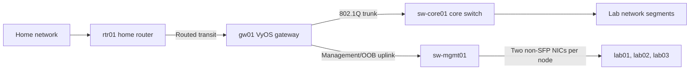

# Lab v2 core network

## Summary

The core network uses `gw01`, a Minisforum VP6630 running VyOS, for Layer 3
routing, firewall policy, and NAT. `sw-core01`, a MikroTik CRS309-1G-8S+IN,
handles core Layer 2 switching and VLAN transport. `sw-mgmt01`, a TRENDnet
TEG-3102WS, connects both non-SFP NICs from each MS-02 node to `gw01` for
management/OOB traffic. `rtr01`, a second MikroTik CRS309-1G-8S+IN, acts as the
home router and connects the lab to the home network and the internet. Device
names are canonical per the [naming registry](../../reference/naming.md).

This design defines device responsibilities, logical topology, configuration
requirements, failure boundaries, and verification criteria. Address
allocation, VLAN allocation, physical port assignment, and network-service
ownership are outside this document.

## Goals

- Keep routing and traffic policy on `gw01`.
- Keep core VLAN transport and physical switching on `sw-core01`.
- Carry MS-02 management/OOB traffic through `sw-mgmt01`.
- Route home-to-lab traffic without source NAT.
- Apply source NAT to lab-to-internet traffic on `gw01`.
- Store network-device configuration in version control.
- Validate behavior before saving a deployed configuration.
- Preserve a recovery path that does not depend on the primary network path.

## Non-goals

- Address and VLAN allocation
- Physical port and cable assignment
- DHCP, DNS, or time-service ownership
- Compute-platform network configuration
- Workload network overlays
- Application ingress or service advertisement
- Application DNS records
- Service-to-service traffic policy
- Storage protocol design

## Logical Topology

`rtr01` routes traffic between the home network and the `gw01` transit
interface. `gw01` routes lab prefixes, applies firewall policy, and performs
source NAT for internet egress. `sw-core01` carries lab VLANs between `gw01`
and connected lab devices. `sw-mgmt01` connects directly to `gw01` and carries
management/OOB traffic for both non-SFP NICs on each MS-02 node.
The [physical connection map](../../reference/networking/physical-connections.md) is the
authoritative port-to-port cabling record.

## Device Responsibilities

| Device | Responsibilities |
| --- | --- |
| `rtr01` (MikroTik CRS309-1G-8S+IN) | Home-network routing, internet access, and the upstream side of the routed lab transit |
| `gw01` (Minisforum VP6630 running VyOS) | Lab gateways, route selection, firewall policy, source NAT, the downstream side of the routed transit, and the management/OOB gateway |
| `sw-core01` (MikroTik CRS309-1G-8S+IN) | Core VLAN transport, access ports, trunks, and physical link aggregation |
| `sw-mgmt01` (TRENDnet TEG-3102WS) | Layer 2 management/OOB connectivity for both non-SFP NICs on each MS-02 and a direct uplink to `gw01` |

[ADR-0001](../../decisions/0001-use-vyos-for-layer-3-and-switches-for-layer-2.md)
defines the Layer 2 and Layer 3 boundary.

## Routing and NAT

The routing design has these invariants:

- `rtr01` has routes for lab prefixes through the `gw01` transit address.
- `gw01` uses the `rtr01` transit address as its default route.
- `gw01` owns the gateway address for every routed lab segment.
- `sw-core01` and `sw-mgmt01` do not route between lab segments.
- Home-to-lab traffic retains its original source address.
- `gw01` applies source NAT to lab-to-internet traffic.
- Firewall rules distinguish new connections from established reply traffic.

## Traffic Policy

`gw01` enforces policy for:

- Home network to lab segments
- Lab segments to the home network
- Lab segments to the internet
- Traffic between routed lab segments
- Traffic addressed to `gw01`
- Management/OOB traffic through `sw-mgmt01`
- Management traffic addressed to network devices

Each firewall rule identifies the source, destination, protocol, destination
port, connection direction, and owner. Rules permit required flows explicitly.
Stateful rules permit established reply traffic without permitting a new flow in
the reverse direction.

## Configuration Requirements

`gw01`, `sw-core01`, and `sw-mgmt01` each have one version-controlled
configuration source. The deployment process:

1. Renders the effective configuration.
2. Validates syntax and policy before deployment.
3. Shows the effective change for operator review.
4. Applies the change without saving it as the startup configuration.
5. Verifies required connectivity and policy behavior.
6. Saves the configuration only after verification succeeds.
7. Restores the previous configuration when verification fails.

Drift detection compares each running configuration with its repository source.

## Management and Recovery

Firewall policy limits routine management access to approved source networks.
`sw-mgmt01` carries management/OOB traffic from both non-SFP NICs on each
MS-02 node directly to `gw01`.

Each network device has a recovery path that remains available when its
production configuration or primary network link fails. Recovery credentials do
not reside in device configuration committed to the repository.

## Failure Boundaries

| Failure | Effect |
| --- | --- |
| `rtr01` failure | The lab loses home-network and internet connectivity. Internal lab switching and routing remain available. |
| `gw01` failure | Routed lab segments lose their gateways, inter-segment routing, policy enforcement, management/OOB gateway, and internet egress. |
| `sw-core01` failure | Devices connected through `sw-core01` lose Layer 2 connectivity. |
| `sw-mgmt01` or its `gw01` uplink failure | Both non-SFP NICs on each MS-02 lose management/OOB connectivity. |
| Routed transit failure | Home-to-lab and lab-to-internet traffic stop. Internal lab traffic remains available within its unaffected Layer 2 and Layer 3 paths. |
| `gw01`-to-`sw-core01` trunk failure | VLANs carried by the trunk lose their `gw01` gateways. |
| Invalid configuration | Deployment verification fails and the previous configuration is restored. |

## Verification

A deployment is valid when the observed behavior matches these checks:

- Every connected interface reports the assigned link state and speed.
- Each VLAN is present only on its assigned access ports and trunks.
- A client in each routed segment reaches its `gw01` gateway.
- The `rtr01` and `gw01` route tables contain the required transit and lab routes.
- Home-to-lab traffic retains its home-network source address.
- Lab-to-internet traffic uses the `gw01` source-NAT address.
- Each permitted firewall flow succeeds.
- Each denied firewall flow fails.
- Established reply traffic succeeds without enabling a new reverse flow.
- Both non-SFP NICs on each MS-02 connect through `sw-mgmt01`.
- MS-02 management/OOB traffic reaches `gw01` through the `sw-mgmt01` uplink.
- Management access succeeds only from approved source networks.
- A failed deployment restores the previous configuration.
