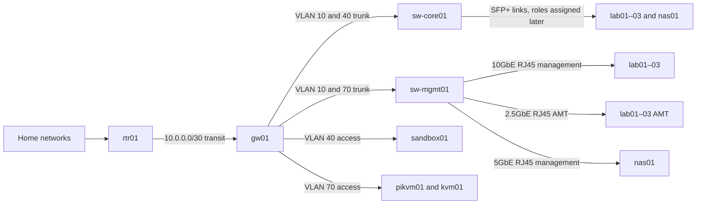

# Lab v2 core network

## Summary

The core network uses `gw01`, a Protectli VP6630 running VyOS, for Layer 3
routing, firewall policy, DHCP, DNS forwarding, Tailscale routing, and source
NAT. `sw-core01`, a MikroTik CRS309-1G-8S+IN, carries core VLANs and the
compute-facing SFP+ links. `sw-mgmt01`, a TRENDnet TEG-3102WS, separates the
MS-02 10GbE management interfaces from their 2.5GbE AMT interfaces.

The [network address and VLAN plan](../reference/networking/address-plan.md)
defines the exact prefixes, gateways, allocations, interface mapping, and
switch port roles. The
[physical connection map](../reference/networking/physical-connections.md)
defines the installed cables.

## Context and Scope

`rtr01` connects the home network and internet to `gw01` through a routed
point-to-point transit. `gw01` is the Layer 3 boundary for every lab VLAN.
The switches remain Layer 2 devices under
[ADR-0001](../decisions/0001-use-vyos-for-layer-3-and-switches-for-layer-2.md).

The design retains the deployed `10.10.0.0/16` lab aggregate and the proven
home-to-lab transit. It removes the former Tinkerbell/PXE network, UM760
platform-cluster assumptions, BGP peers, PowerDNS authority, IncusOS artifact
server, and `bootstrap-k0s` service. The UM760 becomes `sandbox01`, a general
test and spike host outside the IncusOS cluster.

## Goals

- Give every bare-metal management and OOB endpoint a deterministic DHCP
  reservation.
- Keep management, OOB, and sandbox/workload traffic in separate VLANs.
- Keep routing, DHCP, DNS forwarding, traffic policy, and NAT on `gw01`.
- Route home-to-lab traffic without source NAT.
- Apply source NAT to lab-to-internet traffic.
- Keep core VLAN transport and physical switching on the dedicated switches.
- Store network-device configuration in version control.
- Validate behavior before saving a deployed configuration.
- Preserve local-console recovery when the routed network is unavailable.

## Non-goals

- Compute-facing SFP+ bond and link-aggregation policy
- Kubernetes cluster, pod, service, or load-balancer IPAM
- Application ingress and service advertisement
- Storage protocol and storage-network design
- Application DNS records
- General service-to-service policy
- Time-service ownership
- Dynamic routing without a confirmed consumer

## Design Overview

`gw01` owns the gateway address for VLAN 10 management, VLAN 40
sandbox/workload, and VLAN 70 OOB. The management switch presents VLAN 10 as
untagged access to the upper 10GbE RJ45 port on each MS-02 and VLAN 70 as
untagged access to the lower 2.5GbE vPro/AMT port. Both VLANs use a tagged
uplink to `gw01`.

The two MS-02 SFP+ interfaces and the `nas01` 10GbE interface remain physically
connected to `sw-core01`. Their instance, cluster, storage, and aggregation
roles are deferred. Initial IncusOS installation and management do not depend
on those links.

## Device Responsibilities

| Device | Responsibilities |
| --- | --- |
| `rtr01` | Home routing, internet edge, upstream transit endpoint, and route to `10.10.0.0/16` |
| `gw01` | Lab gateways, static routing, firewall policy, DHCP, DNS forwarding, Tailscale subnet routing, source NAT, and local `glab.lol` mirror |
| `sw-core01` | Layer 2 transport for management and future compute-facing VLANs |
| `sw-mgmt01` | Layer 2 separation of host management and AMT/OOB traffic |
| `sandbox01` | General-purpose tests and spikes on the isolated sandbox/workload VLAN |

`gw01` does not run PowerDNS, an IncusOS artifact server, `bootstrap-k0s`, or
BGP. Product-side componere tooling builds and burns or serves IncusOS media
locally when needed.

## Addressing, DHCP, and DNS

The [network address and VLAN plan](../reference/networking/address-plan.md)
is the single source for address and port values.

`gw01` provides DHCP on every client VLAN. Named endpoints use reservations
bound to permanent hardware MAC addresses. Unnamed temporary clients use the
documented dynamic pools. IncusOS seeds request DHCP on each node's 10GbE RJ45
management interface; AMT independently requests DHCP on the 2.5GbE interface.

Clients use their `gw01` VLAN gateway as the DNS resolver. `gw01` forwards
`glab.lol` to its local mirror of the private Route 53 zone and sends other
queries to configured recursive resolvers. The gateway does not serve the
legacy `lab.gilman.io` zone.

This cold-start model assumes `gw01` is installed and its version-controlled
network configuration is applied before managed machines boot.

## Routing and NAT

- `rtr01` routes `10.10.0.0/16` through `10.0.0.2`.
- `gw01` uses `10.0.0.1` as its default route.
- `gw01` owns the gateway for every routed lab VLAN.
- Neither switch routes between lab segments.
- Home-to-lab and inter-VLAN traffic retain their source addresses.
- `gw01` applies source NAT only to lab traffic leaving for the internet.
- The initial design uses connected and static routes only.

BGP returns only through a later design with a concrete dynamic-routing or
service-advertisement requirement.

## Traffic Policy

`gw01` applies a default-deny policy to routed VLAN boundaries and traffic
addressed to the gateway. Stateful rules permit established and related reply
traffic.

The baseline policy permits:

- DHCP and DNS from each client VLAN to `gw01`;
- approved home and Tailscale administration sources to management and OOB;
- required management flows from management to managed lab endpoints;
- internet egress from management and sandbox/workload;
- explicit `glab.lol` mirror traffic.

The sandbox/workload VLAN cannot initiate connections to management or OOB.
Each additional flow identifies its source, destination, protocol, destination
port, direction, and owner in the version-controlled gateway policy.

## Configuration and Deployment

`gw01`, `sw-core01`, and `sw-mgmt01` each have one version-controlled
configuration source. A deployment:

1. Renders the effective configuration.
2. Validates syntax and policy.
3. Shows the effective change for operator review.
4. Applies the candidate without saving it as startup configuration.
5. Verifies required connectivity and denied flows.
6. Saves only after verification succeeds.
7. Restores the previous configuration when verification fails.

Drift detection compares each running configuration with its repository source.
Legacy configuration is migration input, not a second source of truth.

## Management and Recovery

Routine host management uses VLAN 10. AMT, `pikvm01`, `kvm01`, and
`sw-mgmt01` administration use VLAN 70. Their separation prevents a host
management configuration error from placing AMT directly on the same Layer 2
segment.

The PiKVM and TESmart chain provides remote console access to the connected
hosts. A local monitor, keyboard, and mouse attached to `pikvm01` remain the
break-glass path when `gw01` or routed access is unavailable.

Recovery credentials do not reside in committed device configuration.

## Failure Boundaries

| Failure | Effect |
| --- | --- |
| `rtr01` | The lab loses home and internet connectivity; internal VLAN routing remains available. |
| `gw01` | Routed VLANs lose gateways, DHCP, DNS forwarding, policy enforcement, Tailscale routing, and internet egress. |
| `sw-core01` | Compute-facing SFP+ links and its management path fail; copper management and OOB remain available through `sw-mgmt01`. |
| `sw-mgmt01` or its trunk | MS-02 copper management and AMT, `nas01` copper management, and management-switch administration fail. |
| One MS-02 management access port | That node loses routine management; its separate AMT port remains available. |
| One MS-02 AMT access port | That node loses AMT; its separate management port remains available. |
| Invalid candidate configuration | Verification fails and the previous startup configuration remains or is restored. |

## Delivery

Migration from the current VyOS configuration removes VLAN 20, Tinkerbell
firewall rules, PowerDNS, IncusOS artifact serving, `bootstrap-k0s`, BGP, and
legacy UM760 bridge behavior. It renames the router to `gw01`, establishes the
management-switch trunk, and applies the canonical DHCP reservations and
firewall boundaries.

The network may migrate one VLAN at a time. Preserve the routed transit and
current OOB access until replacement paths pass verification.

## Verification

A deployment is valid when:

- every connected interface reports the expected link state and negotiated
  speed;
- each VLAN appears only on its assigned access ports and trunks;
- each named endpoint receives its reserved address;
- each client receives `gw01` as its default gateway and DNS resolver;
- `glab.lol` resolves through the local mirror while public DNS still resolves;
- the `rtr01` and `gw01` route tables contain the transit and lab routes;
- home-to-lab traffic retains its home source address;
- lab-to-internet traffic uses the `gw01` source-NAT address;
- each permitted firewall flow succeeds and each denied flow fails;
- the sandbox cannot initiate management or OOB connections;
- each MS-02 retains management when its AMT link is disconnected and retains
  AMT when its management link is disconnected;
- no BGP peers or retired gateway services remain;
- a failed candidate deployment leaves or restores the previous startup
  configuration.

## Alternatives Considered

### Retain the full legacy VyOS configuration

Rejected because it encodes the abandoned PXE/Tinkerbell path, the former
UM760 platform cluster, permissive inter-VLAN forwarding, BGP peers without a
consumer, and services that no longer belong on the gateway.

### Use static addresses in IncusOS seeds

Rejected in favor of DHCP reservations. Reservations keep addresses
deterministic while centralizing changes and MAC-to-address ownership on
`gw01`.

### Combine management and OOB

Rejected because independent VLANs preserve a recovery path when routine host
networking is misconfigured and allow narrower firewall policy.
